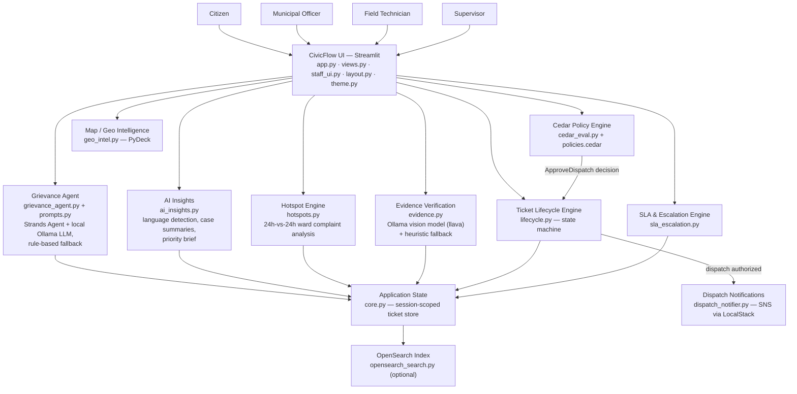

# CivicFlow
### Cleaner Cities. Happier Communities.
 
A civic issue management platform that connects **citizens, municipal officers, field technicians, and supervisors** through one end-to-end workflow — reporting, AI-assisted routing, dispatch authorization, field resolution, SLA tracking, escalation, and city-wide monitoring.
 
*From citizen complaint to field resolution — CivicFlow makes every civic issue visible, actionable, and accountable.*


 
---
 
## Table of Contents
- [Problem](#problem)
- [Why Existing Approaches Fall Short](#why-existing-approaches-fall-short)
- [Our Solution](#our-solution)
- [How CivicFlow Works](#how-civicflow-works)
- [Four Role-Based Experiences](#four-role-based-experiences)
- [Feature Matrix](#feature-matrix)
- [System Architecture](#system-architecture)
- [End-to-End Workflow](#end-to-end-workflow)
- [AI & Intelligent Automation](#ai--intelligent-automation)
- [SLA & Escalation Engine](#sla--escalation-engine)
- [Authorization & Security](#authorization--security)
- [Technology Stack](#technology-stack)
- [Technology → Where It Is Used](#technology--where-it-is-used)
- [Project Structure](#project-structure)
- [Dashboard Screenshots](#dashboard-screenshots)
- [How CivicFlow Solves the Problem](#how-civicflow-solves-the-problem)
- [Why CivicFlow](#why-civicflow)
- [Quick Demo](#quick-demo)
- [Getting Started](#getting-started)
- [Running the Application](#running-the-application)
- [Future Scope](#future-scope)
- [Impact](#impact)
- [Design & UX](#design--ux)
---
 
## Problem
 
Civic issue reporting in most municipalities is still fragmented across phone calls, paper registers, and informal channels. This creates a handful of concrete, recurring failures:
 
- **Reporting is hard and language-limited.** A citizen describing an issue in English, Hindi, or Hinglish often has no structured way to submit it.
- **Routing is manual and inconsistent.** Nothing automatically decides which department (Electrical, Water, Roads, Sanitation) an issue belongs to.
- **Duplicate reports create noise.** The same pothole reported by five citizens can become five untracked, disconnected entries.
- **Citizens have no visibility once they report.** There's no shared place to track a complaint's status.
- **Field teams work from an undifferentiated queue**, without a consistent way to see what's urgent versus routine.
- **Nobody enforces response times.** Without SLA tracking, a critical ticket can sit unattended indefinitely.
- **Escalation doesn't happen on its own.** A breached or disputed ticket needs someone to notice it manually.
- **Dispatch approval has no audit trail.** There's typically no consistent, explainable record of who authorized a costly emergency crew and why.
- **Supervisors lack city-wide visibility** — no single view of hotspots, SLA compliance, or what to prioritize.
```
Citizen
   ↓
Complaint (text / voice / photo / document)
   ↓
AI Triage & Routing
   ↓
Municipal Officer
   ↓
Field Resolution
   ↓
Supervisor Monitoring
   ↓
Citizen Feedback
```
 
---
 ## Why Existing Approaches Fall Short
 
| Challenge | Traditional Approach | CivicFlow |
|---|---|---|
| Reporting | Phone call / paper register, single language | In-app text, voice, photo, or document intake; auto-detects English, Hindi, and Hinglish |
| Routing | A human reads and manually forwards the complaint | Rule-based / LLM-assisted triage (`grievance_agent.py`) auto-classifies department, ward, urgency, and team |
| Tracking | Citizen has to call back to ask for status | A persistent ticket lifecycle (`lifecycle.py`) the citizen can track from **My Complaints → Track Status** |
| Prioritization | First-come, first-served, or ad hoc | Urgency scoring (1–5), an AI case summary, and ward-level hotspot detection surface what matters first |
| Escalation | Someone has to remember to follow up | SLA timers auto-escalate breached or citizen-disputed tickets up the chain (`sla_escalation.py`) |
| Field Operations | Paper work orders | A structured queue per Field Technician with location, urgency, and required evidence |
| Supervisor Visibility | Spreadsheets, if anything | A live dashboard: heatmap, department breakdown, SLA compliance, escalation queue, AI priority brief |
| Citizen Feedback | Rarely captured | A 👍/👎 confirmation step that re-opens and escalates a ticket if the citizen disputes the fix |
 
CivicFlow does not claim to outperform every traditional system in every dimension — it is a working prototype that demonstrates a **coherent, auditable, end-to-end pipeline** where most such systems only cover one or two stages of the process.
 
---
 
## Our Solution
 
CivicFlow implements the full civic-complaint lifecycle as a single connected pipeline instead of a set of disconnected tools:
 
1. A **citizen** reports an issue (text, voice, photo, or document).
2. The raw complaint is captured, along with optional location and category hints.
3. **Language detection** identifies English / Hindi / Hinglish and produces an English gloss for officers.
4. A **local AI agent** (Strands + Ollama, with a deterministic rule-based fallback) classifies department, ward, urgency, team, and a recommended action.
5. A **ticket** is created — or, if a matching active ticket already exists for that department/location, the report is **merged as a duplicate** instead.
6. The **Municipal Officer** reviews the AI-generated case summary and moves the ticket forward.
7. A **Field Technician** (or officer) dispatches a crew — gated by the **Cedar** policy engine.
8. The ticket progresses through a defined **state machine**: `NEW → AI TRIAGED → ASSIGNED → IN PROGRESS → (AWAITING APPROVAL) → RESOLVED → CITIZEN VERIFIED → CLOSED`.
9. **SLA timers** run continuously against the ticket's urgency-based target.
10. **Escalation** fires automatically on SLA breach or citizen dispute.
11. The **Supervisor** monitors city-wide hotspots, SLA compliance, and an AI-generated priority brief.
12. The **citizen** confirms or disputes the resolution, closing the loop.
---
 
## How CivicFlow Works
 
At its core, CivicFlow is a **Streamlit application with a single shared in-memory ticket store** (`core.py`, held in `st.session_state`), read and written by four role-specific UI surfaces (`views.py` for citizens, `staff_ui.py` for officers/technicians/supervisors) that all operate on the same ticket lifecycle, SLA engine, and authorization layer.
 
---
 
## Four Role-Based Experiences
 
### 1 Citizen
 
| Feature (as implemented) | What the citizen sees | Why it matters |
|---|---|---|
| **Home dashboard** | Welcome banner, personal stats (total / resolved / in progress / pending review), a report form, a mini issue map, and quick-pick common issues | One screen to report, track, and see the city at a glance |
| **Report an Issue** | Tabs for **Text / Voice / Photo / Document** input, an optional location field, an "auto-detect" category selector, and sample complaints to try | Removes the friction of describing an issue in a fixed format |
| **Language handling** | The submitted complaint is auto-detected as English, Hindi, or Hinglish, with an English gloss shown alongside the original | Lets officers act on the complaint without needing to speak the citizen's language |
| **My Complaints** | A full table of every complaint the citizen has filed, with department, ward, status, priority, and last-updated time | Full personal history in one place |
| **Track Status** | A per-ticket lifecycle tracker plus the AI case summary, with a 👍/👎 confirmation step once a ticket is Resolved | Real-time visibility instead of "call back later" |
| **Map & Hotspots** | The same heatmap/ward-cluster map used by staff, plus the AI hotspot list | Shows the citizen what's happening across the city, not just their own ticket |
| **Common Issues** shortcuts | One-tap buttons (Street Light, Water Supply, Garbage, Pothole, Drainage, Other) that pre-fill a sample report | Faster reporting for the most frequent issue types |
| **Give Feedback** | A star/emoji rating plus free-text feedback, stored for the session | A lightweight satisfaction signal separate from per-ticket confirmation |
| **Community** | Active city hotspots plus a short list of civic tips | Civic awareness beyond the citizen's own complaints |
| **Help & Support** | An urgent-helpline callout and an FAQ covering routing, SLA targets, disputing a fix, and language support | Answers the most common "how does this work" questions in-app |
 

 
### 2 Municipal Officer
 
| Feature (as implemented) | What the officer does |
|---|---|
| **Dashboard** | KPI tiles (Critical / High / Medium / Low / SLA-at-risk), an assigned-to-you queue sorted by SLA urgency, a map, SLA compliance, AI priority brief, recent activity, and quick actions |
| **Ticket Center (Command Center)** | Select any ticket to see its **AI case summary**, lifecycle tracker, SLA gauge, escalation chain, and the available next action for the current state |
| **Approvals** | Two queues: high-urgency dispatches awaiting Cedar-gated authorization, and resolutions submitted by a technician awaiting officer sign-off (required whenever urgency ≥ 4) |
| **Resolution evidence review** | Views a technician's submitted photo plus the AI verification checklist (vision-model or heuristic) before approving |
| **City Map & Hotspots** | The same heatmap/hotspot view as the Supervisor, scoped to what's active |
| **Analytics** | Complaints by category, average resolution time by department, and per-ward SLA-met percentage |
| **Registry & Audit** | The full ticket registry and the authorization/lifecycle/escalation audit log |
| **Notifications** | SLA-risk/breach alerts for tickets in the officer's active set, plus city-wide broadcasts they can send |
 

 
### 3 Field Technician
 
| Feature (as implemented) | What the technician does |
|---|---|
| **My Crew Queue** | Only tickets in `ASSIGNED` or `IN PROGRESS` state, sorted by SLA urgency, with urgency badge, ward, department, and current SLA message |
| **Dispatch crew** | Moves a ticket from `ASSIGNED` to `IN PROGRESS` — this action is evaluated by the **Cedar** policy engine, which permits a technician to self-dispatch only low-urgency Electrical & Power work under a cost ceiling; anything else requires an officer or supervisor |
| **Resolution evidence** | Uploads a completed-work photo and work notes; the AI verification step (vision model or heuristic checks) runs before submission is accepted |
| **Ticket Center** | The same command-center detail view as the officer, scoped to the technician's own assigned tickets |
| **Map** | A read-only heatmap/ward view for situational awareness |
 
This role is the bridge between the digital ticket and the physical repair: it turns an abstract "ASSIGNED" ticket into a concrete work order with location, urgency, and a required proof-of-work step.
 

 
### 4 Supervisor
 
| Feature (as implemented) | What the supervisor sees |
|---|---|
| **City-wide dashboard** | Total complaints, critical issues, SLA breaches, resolved-this-week, and active field crews as KPI tiles |
| **City Issue Heatmap** | A PyDeck map with heatmap, ward-cluster, and per-issue marker layers, click-through to a ward detail panel |
| **Critical & Escalated Tickets** | A ranked list of urgency-5/at-risk/breached tickets with one-click "open" |
| **Department-wise Tickets** | A bar breakdown of active complaint volume by department |
| **SLA Compliance** | A donut chart of on-time / at-risk / breached tickets |
| **AI Priority Brief** | A ranked "what to fix first" list blending hotspot scores with raw open-ticket signals |
| **Escalation Queue** | Every ticket that has escalated, been disputed by a citizen, or breached/at-risk its SLA |
| **Recent Activity** | A live feed of the latest lifecycle transitions across all tickets |
| **All Tickets / Registry & Audit** | The full ticket command center plus the complete audit log, downloadable as CSV |
| **Team Management** | Per-team active/in-progress/critical/breached counts, and a manual ticket-reassignment tool |
| **Ward Analytics** | The same category/resolution-time/SLA-by-ward breakdown available to officers |
| **Approvals** | The same dispatch/resolution approval queues as the officer role |
| **Policy & Authorization** | The Cedar decision log, an interactive authorization simulator (pick a role + ticket, see the decision), and the raw `policies.cedar` source |
| **Reports** | Downloadable registry CSV plus the full AI Priority Brief |
| **Notifications** | SLA alerts plus the ability to send a city-wide broadcast |
 

 
---
## Feature Matrix
 
| Feature | Citizen | Officer | Field Technician | Supervisor |
|---|:---:|:---:|:---:|:---:|
| Report Issue | ✅ | | | |
| Multilingual Intake (EN/HI/Hinglish) | ✅ | | | |
| Ticket Tracking | ✅ | ✅ | ✅ | ✅ |
| AI Case Summary | ✅ | ✅ | ✅ | ✅ |
| Duplicate Merge | ✅ (automatic) | | | |
| Dispatch Authorization (Cedar) | | ✅ | ✅ (restricted) | ✅ |
| Resolution Evidence & Verification | ✅ (views) | ✅ | ✅ (submits) | ✅ |
| SLA Monitoring | | ✅ | ✅ | ✅ |
| Automatic Escalation | | ✅ | | ✅ |
| Field Work Queue | | | ✅ | |
| City Heatmap | ✅ | ✅ | ✅ | ✅ |
| Ward Analytics | | ✅ | | ✅ |
| AI Hotspot Detection | ✅ (view only) | ✅ | | ✅ |
| AI Priority Brief | | ✅ (view) | | ✅ |
| Team Reassignment | | | | ✅ |
| Full-Text Ticket Search | ✅ | ✅ | ✅ | ✅ |
| Audit Log / Registry | | ✅ | | ✅ |
| Feedback / Community | ✅ | | | |
| Broadcast Notifications | (receives) | ✅ (sends) | (receives) | ✅ (sends) |
 
---
 
## System Architecture
 


---
### Layers explained
 
| Layer | Modules | Responsibility |
|---|---|---|
| **Presentation** | `app.py`, `views.py`, `staff_ui.py`, `layout.py`, `theme.py` | Role-based pages, header (search, bell, user switch), sidebar navigation, design system |
| **Application / workflow** | `core.py`, `lifecycle.py` | Shared state, seed data, intake, duplicate merge, dispatch, resolution, citizen closure, audit log; the ticket state machine and role rules |
| **AI** | `grievance_agent.py`, `ai_insights.py`, `evidence.py` | Triage, language detection and gloss, case summaries, priority brief, evidence verification |
| **SLA / escalation** | `sla_escalation.py`, `hotspots.py` | SLA status, auto-escalation, explainable escalation reports, 24h-vs-24h hotspot detection |
| **Authorization** | `cedar_eval.py`, `policies.cedar` | Cedar policy evaluation for dispatch, with a Python mirror fallback |
| **Data / persistence** | `st.session_state` (in `core.py`) | Tickets, audit log and feedback are held in session state (prototype) |
| **External services** | `dispatch_notifier.py`, `opensearch_search.py`, Ollama | SNS events, full-text search, local LLM and vision model. All are optional and fail soft |
 
---
 
## End-to-End Workflow
 

 
```mermaid
flowchart LR
    A["Citizen reports<br/>text / voice / photo / document"] --> B["Language detection<br/>and gloss"]
    B --> C["AI triage<br/>department, ward, team, urgency"]
    C --> D{"Same department and<br/>location already open?"}
    D -- Yes --> E["Merge as duplicate<br/>raise urgency if higher"]
    D -- No --> F["Create ticket<br/>NEW to AI TRIAGED to ASSIGNED"]
    E --> G["Dispatch crew<br/>Cedar check + SNS event"]
    F --> G
    G --> H["Technician submits<br/>photo evidence"]
    H --> I["AI evidence verification"]
    I --> J{"Urgency 4 or 5?"}
    J -- Yes --> K["Officer approval"]
    J -- No --> L["Resolved"]
    K --> L
    L --> M{"Citizen response"}
    M -- Confirms --> N["Citizen verified, then Closed"]
    M -- Disputes --> O["Reopened and escalated<br/>to Supervisor"]
    O --> G
```

| Stage | What happens |
|---|---|
| Report | Complaint text is captured with optional location and category |
| Triage | Department, ward, team, urgency, priority label and recommended action are produced |
| Duplicate check | Same department and same known location as an active ticket → merged |
| Ticket | New ticket goes `NEW → AI TRIAGED → ASSIGNED` |
| Dispatch | A role dispatches; Cedar returns ALLOW/DENY; on ALLOW an SNS event is published and the ticket moves to `IN PROGRESS` |
| Evidence | Photo + notes are verified; failing evidence is flagged for review |
| Approval | Urgency ≥ 4 goes through `AWAITING APPROVAL` |
| SLA | Every rerun re-evaluates SLA status and escalates when thresholds pass |
| Closure | Citizen confirms (`CITIZEN VERIFIED`) and an officer closes, or the citizen disputes and the ticket returns to `IN PROGRESS` |
| Monitoring | Supervisors watch the whole flow through dashboards |
 
---
 
## AI & Intelligent Automation
 
| Feature | Type | Input → Output | Where used | If AI/service is unavailable |
|---|---|---|---|---|
| **Complaint triage** (`grievance_agent.py`) | Keyword rule engine **plus** a Strands Agent using Ollama (`llama3.2` by default) with a Pydantic-typed tool `emit_orchestrated_ticket` | Raw text → department, ward, team, urgency, priority label, recommended action, location hint | `core.ingest_complaint` | The rule-engine result is always computed first. The agent's JSON overrides it only if parsable; on any error, the rules stand |
| **Language detection + gloss** (`ai_insights.py`) | Dictionary / rule based | Text → `English`, `Hindi` (Devanagari) or `Hinglish` (romanised marker words) + a word-for-word English gloss | Routing card, case summary, registry | Pure local code; the gloss is not machine translation, and Devanagari text has no dictionary entries |
| **Duplicate detection** (`core.py`) | Rule based | Department + location keyword vs. active tickets → merge or new | Intake | n/a |
| **AI case summary** (`ai_insights.generate_case_summary`) | Keyword based | Ticket → problem, location, duration open, impact bullets, priority, action | Command center, citizen track view | Pure local code |
| **AI priority brief** (`ai_insights.generate_priority_brief`) | Scoring heuristic | Tickets + hotspots → ranked wards (score = hotspot score + 5 × critical + complaints) | Supervisor dashboard, Reports | Pure local code |
| **Hotspot detection** (`hotspots.py`) | Deterministic statistics | Report timestamps → last-24h vs previous-24h growth per ward and department, with "because" reasons | Dashboards, Community | Pure local code |
| **Resolution evidence check** (`evidence.py`) | Vision model (`llava`) **or** heuristics | Photo + filename + notes + ticket → checks for photo quality, subject, GPS distance (EXIF, ≤ 1.5 km), resolved | Evidence form | Falls back to heuristics (image sanity, EXIF GPS, filename/notes keywords). The UI states which mode ran |
| **Escalation reasoning** (`sla_escalation.py`) | Rule based | Ticket + SLA → reasons (sensitive sites, hazard keywords, duplicates, disputes) and recommended action | Command center, Escalations page | Pure local code |
| **Full-text search** (`opensearch_search.py`) | OpenSearch fuzzy `multi_match` | Query → ranked ticket IDs | Header search | Falls back to a substring scan over the same fields |
 
---
 
## SLA & Escalation Engine
 
**SLA** is the response-time target attached to each ticket by urgency:
 
| Urgency | Label | SLA target |
|:---:|---|---|
| 5 | Critical | 30 min |
| 4 | High | 2 h |
| 3 | Medium | 12 h |
| 2 | Routine / Low | 24 h |
| 1 | Low | 72 h |
 
**Status for open tickets**
 
| Status | Rule |
|---|---|
| `ON TRACK` | < 70% of the SLA used |
| `AT RISK` | ≥ 70% used |
| `BREACHED` | ≥ 100% used |
| `MET` / `MISSED` | For closed tickets: resolved inside / after the target. The clock stops at `RESOLVED` and restarts if the ticket is reopened |
 
**Escalation chain:** Field Technician → Municipal Officer → Supervisor.
 
- At **100%** of the SLA the ticket escalates to the **Municipal Officer**.
- At **150%** it escalates to the **Supervisor**.
- A **citizen dispute** escalates straight to the **Supervisor**.
- Escalation runs on every app rerun, is idempotent (each level fires once) and writes a note to the ticket history and the audit log.
Supervisors see this in *Critical & Escalated Tickets*, the *Escalation Queue*, the *Escalations* page and the SLA Compliance card.
 
---
 
## Authorization & Security
 
Dispatching a crew commits money and people, so it is guarded by **Cedar** policies (`policies.cedar`), evaluated by `cedar_eval.py` with the `cedarpy` engine. If `cedarpy` is not installed, a **Python mirror** of the same rules is used and the decision says so.
 
| Policy | Effect |
|---|---|
| `EmergencyDispatchPolicy` | Municipal Officers may approve dispatch |
| `SupervisorFullAuthority` | Supervisors hold full dispatch authority |
| `NoSelfDispatchOnHighUrgency` | **Forbid** Field Technicians for urgency ≥ 4 |
| `FieldTechLowUrgencyElectrical` | Field Technicians may self-dispatch only urgency < 4, Electrical & Power, cost ≤ ₹25,000 |
 
- **Protected action:** `ApproveDispatch` (the `ASSIGNED → IN PROGRESS` step).
- **Where it runs:** `core.dispatch_crew`, called from the command center and the Approvals page.
- **Explainability:** every decision is stored on the ticket and in the audit log, and shown in **Authorization Details** (flow, principal, action, resource, cost, decision, policy ID, reason, engine). Supervisors can replay decisions in the **Policy simulator**.
- **Other steps** (approve resolution, close, citizen confirm) are guarded by role lists in `lifecycle.py`, not by Cedar.
- **SNS via LocalStack:** on an allowed dispatch, `dispatch_notifier.py` publishes a `DISPATCHED_TO_FIELD` event to the `civictech-dispatch-events` topic. Locally this uses **LocalStack** with mock credentials, so no AWS account is needed.

---
 
 ## End-to-End Workflow
 
```
Citizen
  ↓
Report Issue (text / voice / photo / document)
  ↓
Language Detection + Evidence Capture
  ↓
AI Triage: Category · Ward · Urgency · Team
  ↓
Ticket Created (or merged as a Duplicate)
  ↓
Municipal Officer reviews AI Case Summary
  ↓
Dispatch Authorization (Cedar policy check)
  ↓
Field Technician: Investigation / Repair
  ↓
Resolution Evidence Submitted → AI Verification
  ↓
SLA Check (on time / at risk / breached)
  ↓
Resolved → Approval (if urgency ≥ 4) → Escalation (if breached/disputed)
  ↓
Supervisor Monitoring (hotspots, SLA, priority brief)
  ↓
Citizen Confirms or Disputes → Closed / Re-opened
```
 
1. **Report Issue** — the citizen submits a complaint through any supported input mode.
2. **Language Detection + Evidence Capture** — the raw text is classified (English/Hindi/Hinglish) and stored alongside any location/category hints.
3. **AI Triage** — `grievance_agent.py` assigns department, ward, urgency, team, and a recommended action.
4. **Ticket Created / Merged** — a new ticket is created, unless an active ticket already matches on department + location, in which case the report merges as a duplicate.
5. **Officer Review** — the officer opens the ticket and reads the AI-generated case summary instead of the raw message.
6. **Dispatch Authorization** — Cedar evaluates whether the requesting role can approve this dispatch, given the ticket's urgency and estimated cost.
7. **Field Resolution** — a technician works the ticket and submits a completed-work photo.
8. **Verification** — the photo is checked by a vision model or, if unavailable, image/GPS/keyword heuristics.
9. **SLA Check** — the ticket's elapsed time is compared against its urgency-based target.
10. **Resolution / Escalation** — high-urgency tickets require officer approval before resolving; breached or disputed tickets escalate automatically.
11. **Supervisor Monitoring** — hotspots, SLA compliance, and the priority brief update continuously.
12. **Citizen Feedback** — a 👍 closes the loop toward `CITIZEN VERIFIED`/`CLOSED`; a 👎 re-opens the ticket and escalates it to a supervisor.
---
## Technology Stack
 
**Frontend**
- Streamlit (wide layout, custom CSS design system), PyDeck (heatmap, clusters, markers), pandas, inline SVG icons
**Backend / application**
- Python 3.11, dataclasses-based lifecycle state machine, Pydantic schemas
**AI / ML**
- Strands Agents SDK with the Ollama model provider (`llama3.2` default, configurable)
- Ollama vision model (`llava` default) for resolution evidence
- Rule-based engines for language detection, summaries, hotspots, priority brief
**Data / storage / search**
- Streamlit session state (prototype store)
- OpenSearch (`opensearch-py`), optional full-text search
**Authorization / security**
- Cedar policies via `cedarpy` (with Python mirror fallback)
**Infrastructure / DevOps**
- Dockerfile (`python:3.11-slim`), compose stack: app + Ollama + LocalStack (SNS) + OpenSearch
- Finch for build/compose; boto3 for SNS; LocalStack for a local AWS-compatible endpoint
**Development tools**
- Pillow (image handling, placeholder photos, EXIF), environment-variable configuration
## Technology → Where It Is Used
 
| Technology | Where used | Purpose |
|---|---|---|
| Python 3.11 | All modules; `Dockerfile` | Application logic |
| Streamlit | `app.py`, `views.py`, `staff_ui.py`, `layout.py`, `theme.py` | Role-based dashboards, navigation, forms |
| PyDeck | `geo_intel.py`, `staff_ui.py`, `views.py` | Heatmap, ward clusters, issue markers, click-to-select ward |
| pandas | `geo_intel.py`, `staff_ui.py`, `views.py` | Map data frames, tables, charts, CSV export |
| Pillow | `core.py`, `evidence.py` | Demo photos; image sanity checks and EXIF GPS |
| Pydantic | `grievance_agent.py` | Typed ticket schema for the agent tool |
| Strands Agents SDK | `grievance_agent.py` | Agent + `@tool emit_orchestrated_ticket` for triage |
| Ollama (`llama3.2`) | `grievance_agent.py` | Local LLM for the triage agent |
| Ollama (`llava`) | `evidence.py` | Vision check of resolution photos |
| Cedar / `cedarpy` | `cedar_eval.py`, `policies.cedar` | Dispatch authorization with explainable decisions |
| boto3 | `dispatch_notifier.py` | SNS publish |
| LocalStack (SNS) | compose file, `dispatch_notifier.py` | Local AWS-compatible SNS endpoint |
| OpenSearch / `opensearch-py` | `opensearch_search.py`, `core.py`, `staff_ui.render_search` | Indexing tickets on every mutation and fuzzy search |
| Finch / Docker | `Dockerfile`, compose file | Build and run the whole stack |
| `lifecycle.py` (dataclass) | `core.py`, `staff_ui.py`, `views.py` | State machine and role-checked transitions |

## Project Structure
 
```text
CivicFlow/
├── app.py                  # Entry point: routing, header, sidebar, time machine, auto-escalation
├── core.py                 # State, seed data, intake, dispatch, resolution, citizen closure, audit log
├── lifecycle.py            # Ticket state machine and role rules
├── sla_escalation.py       # SLA targets, status, auto-escalation, escalation reports
├── hotspots.py             # 24h vs previous-24h hotspot detection
├── geo_intel.py            # PyDeck heatmap, clusters, markers, ward drill-down
├── ai_insights.py          # Language detection, gloss, case summary, priority brief
├── grievance_agent.py      # Strands agent + rule-engine triage
├── prompts.py              # Alternative triage system prompt (not imported by grievance_agent.py)
├── evidence.py             # Resolution-evidence verification (llava or heuristics)
├── cedar_eval.py           # Cedar authorization + Python mirror
├── policies.cedar          # Dispatch policies
├── dispatch_notifier.py    # SNS publisher (LocalStack by default)
├── opensearch_search.py    # Optional OpenSearch index/search with fallback
├── views.py                # Citizen pages + shared components (command center, evidence, analytics)
├── staff_ui.py             # Officer / Technician / Supervisor dashboards and pages
├── layout.py               # Design system CSS, SVG icons, header, sidebar nav
├── theme.py                # Base theme, brand block, pills, stat cards
├── Dockerfile
├── docker-compose.yml      # Compose file for the full stack (use your actual file name)
├── requirements.txt
├── docs/
│   └── images/             # Screenshots and architecture image go here
└── README.md
```
 
| File | Responsibility |
|---|---|
| `app.py` | Chooses the view by the active role; runs SLA auto-escalation on every rerun |
| `core.py` | Single source of business actions; re-indexes tickets into OpenSearch after each change |
| `views.py` | Citizen experience; also hosts shared components used by staff pages. Older `render_officer` / `render_supervisor` remain in the file but are no longer routed |
| `staff_ui.py` | Staff dashboards and pages, search results, quick actions |
| `layout.py` | Header with working search, bell and user switch; sidebar with icons; equal-height card CSS |
 
---
 
## Dashboard Screenshots
 
### Citizen Dashboard

*Report form with four intake channels, KPI cards, issue map, common issues and complaint table.*
 
### Municipal Officer Dashboard

*SLA-sorted queue, ward map panel, SLA compliance and AI priority brief.*
 
### Field Technician Dashboard

*Crew queue limited to assigned and in-progress work.*
 
### Supervisor Dashboard

*City heatmap with hotspot ward panel, critical and escalated tickets, department mix, SLA compliance, escalation queue.*
 
### Ticket / Command Center

*AI case summary, lifecycle, SLA, actions, evidence verification and authorization details.*
 
### AI / Analytics

*Category counts, resolution times, ward SLA performance and the AI priority brief.*
 
---
 
## How CivicFlow Solves the Problem
 
| Problem | CivicFlow mechanism | Result |
|---|---|---|
| Difficult reporting | Four intake tabs, sample complaints, language detection | Structured tickets from free-form input |
| Poor routing | Triage agent + rule engine, team and action assigned automatically | Every ticket starts with a department, team and urgency |
| Duplicate work | Department + location merge | One ticket with a growing report count |
| Lack of transparency | Lifecycle tracker, notifications, citizen confirm/dispute | Citizens see progress and can challenge a fix |
| Delayed resolution | Urgency-based SLA targets | Every open ticket has a deadline and a status |
| SLA failures | Automatic escalation Officer → Supervisor | Breaches surface without anyone remembering to check |
| Lack of field coordination | Crew queue, Cedar-checked dispatch, SNS event, evidence upload | Clear work items and proof of completion |
| Unclear authority | Cedar policies, decision log, simulator | Every dispatch decision has a reason |
| Lack of city-wide visibility | Heatmap, hotspots, analytics, priority brief, reports | Supervisors can see where to act first |
 
## Why CivicFlow
 
| Characteristic | In the implementation |
|---|---|
| **End-to-end lifecycle** | Eight states from `NEW` to `CLOSED`, with reopen on dispute |
| **Four role experiences** | Separate navigation, dashboards and permissions per role |
| **Explainable AI** | Every AI output is traceable to input signals; fallbacks are stated in the UI |
| **SLA-aware workflow** | Targets, status, automatic escalation and reasons |
| **Evidence-based resolution** | Photo required; verified by vision model or transparent heuristics; failed evidence flagged |
| **Policy-guarded actions** | Cedar policies with logged, explainable decisions |
| **Runs fully local** | LLM, events and search run in local containers; no cloud account needed |
| **Fails soft** | Ollama, SNS, OpenSearch and cedarpy are all optional with fallbacks |
 
---
 
## Quick Demo
 
1. **Open the app.** You start as **Citizen (Priya Singh)** with 4 demo complaints.
2. **New ticket:** *Report an Issue → Try a sample complaint →* "Sanitation overflow (Ward 14)" → **Submit Complaint**. A new ticket is created; the routing card shows the Hinglish language tag and an English gloss.
3. **Duplicate merge:** submit the "High voltage cable snapped" sample. It merges into the existing Dayalpur electrical ticket (`CF-1042`).
4. **Switch role** (header → **Switch**) to **Field Technician**. Open `CF-1042` in *Ticket Center* and press **Dispatch crew**: Cedar returns **DENY** (urgency ≥ 4) and *Authorization Details* explains why.
5. **Switch to Municipal Officer** → *Approvals* → **Dispatch** `CF-1042`: **ALLOW**; an SNS event is published (or recorded locally if LocalStack is offline).
6. **Switch to Field Technician** → open an `IN PROGRESS` ticket → upload any JPG/PNG (≥ 200 px) with notes such as "cable replaced" → review the AI verification → **Submit Resolution**.
7. **Switch to Officer** → *Approvals* → **Approve** the resolution.
8. **Switch to Citizen** → *Track Status* → **👎** with a reason: the ticket reopens and escalates to the Supervisor. (Or **👍** to confirm.)
9. **Sidebar → Time machine → +2h.** Switch to **Supervisor** → *Dashboard*: watch SLA breaches, the *Escalation Queue* and *Critical & Escalated Tickets*.
10. **Supervisor extras:** *Team Management* (reassign a ticket), *Reports* (priority brief + CSV), *Policy & Authorization* (simulator).
---
 
## Getting Started
 
### Prerequisites
 
| Requirement | Needed for |
|---|---|
| Python 3.11+ | Running the app |
| `pip` | Installing dependencies |
| Ollama with `llama3.2` and `llava` |  Agent triage and vision verification (rules/heuristics are used otherwise) |
| LocalStack (SNS) |  SNS events on dispatch |
| OpenSearch |  Fuzzy ticket search |
| Finch or Docker |  One-command full stack |
 
### Clone and install
 
```bash
git clone <repository-url>
cd CivicFlow
 
# Linux / macOS
python3 -m venv .venv
source .venv/bin/activate
 
# Windows (PowerShell)
python -m venv .venv
.venv\Scripts\Activate.ps1
 
pip install -r requirements.txt
```

 
## Running the Application
 
**Option A: app only** (everything optional degrades gracefully)
 
```bash
streamlit run app.py
```
 
Open **http://localhost:8501**.
 
**Option B: full local stack with Finch** (app + Ollama + LocalStack + OpenSearch)
 
```bash
finch compose up -d
 
# one-time setup
finch compose exec ollama ollama pull llama3.2
finch compose exec ollama ollama pull llava
finch compose exec localstack awslocal sns create-topic --name civictech-dispatch-events
```
 
Then open **http://localhost:8501**. The compose file sets the service URLs for the app container.
 
**Option C: image only**
 
```bash
finch build -t civicflow .
finch run -p 8501:8501 civicflow
```
---
 
## Future Scope
 
> These are possibilities, **not** implemented features.
 
- Real authentication and identity integration
- Production database instead of session state
- Managed cloud deployment (managed SNS and search endpoints are already selectable through environment variables)
- Real speech-to-text for voice and computer-vision analysis of citizen photos
- Proper machine translation and Devanagari support
- Geocoding and real ward boundaries instead of a fixed location table
- Real-time push/SMS notifications to citizens
- Mobile application
- Predictive maintenance and forecasting on historical tickets
- Crew rosters, per-technician assignment and availability
## Impact
 
| Audience | Value |
|---|---|
| **Citizens** | Easier reporting in their own language, visibility of progress, a way to dispute a fix |
| **Municipal Officers** | A prioritised queue, AI case summaries, clear approval tasks, audit trail |
| **Field Teams** | Actionable work items with context, guardrails on dispatch, evidence-based completion |
| **Supervisors** | City-wide visibility, SLA monitoring, escalation management, analytics and reports |
 
## Design & UX
 
- **Role-specific dashboards** with their own sidebar navigation.
- **Consistent design system** in `layout.py`: Inter typeface, KPI cards, card containers, pill badges and inline SVG icons.
- **Status colours:** red / orange / yellow / green for urgency; coloured pills for lifecycle state and SLA status.
- **Information hierarchy:** KPI row first, then map and critical items, then analytics and operations cards.
- **Maps and analytics:** PyDeck heatmap with ward clusters, department bars, SLA donut, Streamlit charts.
- **Action-oriented flows:** buttons open the relevant ticket, page or approval directly.
- **Desktop-first:** designed for a wide layout.

 


