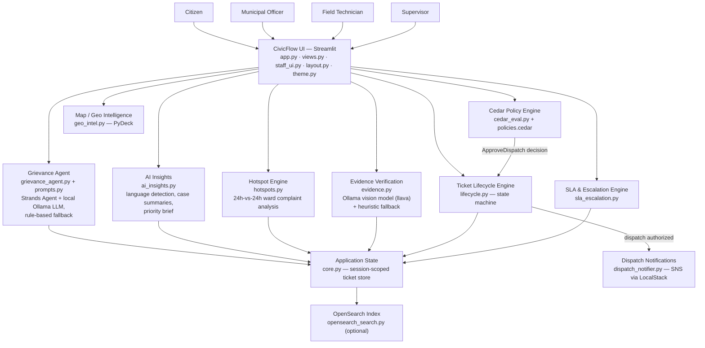

# CivicFlow
### Cleaner Cities. Happier Communities.
 
A civic issue management platform that connects **citizens, municipal officers, field technicians, and supervisors** through one end-to-end workflow — reporting, AI-assisted routing, dispatch authorization, field resolution, SLA tracking, escalation, and city-wide monitoring.
 
*From citizen complaint to field resolution — CivicFlow makes every civic issue visible, actionable, and accountable.*


 
---
 
## Table of Contents
- [Problem](#problem)
- [Why Existing Approaches Fall Short](#why-existing-approaches-fall-short)
- [Our Solution](#our-solution)
- [How CivicFlow Works](#how-civicflow-works)
- [Four Role-Based Experiences](#four-role-based-experiences)
  - [Citizen](#61-citizen)
  - [Municipal Officer](#62-municipal-officer)
  - [Field Technician](#63-field-technician)
  - [Supervisor](#64-supervisor)
- [Feature Matrix](#feature-matrix)
- [System Architecture](#system-architecture)
---
 
## Problem
 
Civic issue reporting in most municipalities is still fragmented across phone calls, paper registers, and informal channels. This creates a handful of concrete, recurring failures:
 
- **Reporting is hard and language-limited.** A citizen describing an issue in English, Hindi, or Hinglish often has no structured way to submit it.
- **Routing is manual and inconsistent.** Nothing automatically decides which department (Electrical, Water, Roads, Sanitation) an issue belongs to.
- **Duplicate reports create noise.** The same pothole reported by five citizens can become five untracked, disconnected entries.
- **Citizens have no visibility once they report.** There's no shared place to track a complaint's status.
- **Field teams work from an undifferentiated queue**, without a consistent way to see what's urgent versus routine.
- **Nobody enforces response times.** Without SLA tracking, a critical ticket can sit unattended indefinitely.
- **Escalation doesn't happen on its own.** A breached or disputed ticket needs someone to notice it manually.
- **Dispatch approval has no audit trail.** There's typically no consistent, explainable record of who authorized a costly emergency crew and why.
- **Supervisors lack city-wide visibility** — no single view of hotspots, SLA compliance, or what to prioritize.
```
Citizen
   ↓
Complaint (text / voice / photo / document)
   ↓
AI Triage & Routing
   ↓
Municipal Officer
   ↓
Field Resolution
   ↓
Supervisor Monitoring
   ↓
Citizen Feedback
```
 
---
 ## Why Existing Approaches Fall Short
 
| Challenge | Traditional Approach | CivicFlow |
|---|---|---|
| Reporting | Phone call / paper register, single language | In-app text, voice, photo, or document intake; auto-detects English, Hindi, and Hinglish |
| Routing | A human reads and manually forwards the complaint | Rule-based / LLM-assisted triage (`grievance_agent.py`) auto-classifies department, ward, urgency, and team |
| Tracking | Citizen has to call back to ask for status | A persistent ticket lifecycle (`lifecycle.py`) the citizen can track from **My Complaints → Track Status** |
| Prioritization | First-come, first-served, or ad hoc | Urgency scoring (1–5), an AI case summary, and ward-level hotspot detection surface what matters first |
| Escalation | Someone has to remember to follow up | SLA timers auto-escalate breached or citizen-disputed tickets up the chain (`sla_escalation.py`) |
| Field Operations | Paper work orders | A structured queue per Field Technician with location, urgency, and required evidence |
| Supervisor Visibility | Spreadsheets, if anything | A live dashboard: heatmap, department breakdown, SLA compliance, escalation queue, AI priority brief |
| Citizen Feedback | Rarely captured | A 👍/👎 confirmation step that re-opens and escalates a ticket if the citizen disputes the fix |
 
CivicFlow does not claim to outperform every traditional system in every dimension — it is a working prototype that demonstrates a **coherent, auditable, end-to-end pipeline** where most such systems only cover one or two stages of the process.
 
---
 
## Our Solution
 
CivicFlow implements the full civic-complaint lifecycle as a single connected pipeline instead of a set of disconnected tools:
 
1. A **citizen** reports an issue (text, voice, photo, or document).
2. The raw complaint is captured, along with optional location and category hints.
3. **Language detection** identifies English / Hindi / Hinglish and produces an English gloss for officers.
4. A **local AI agent** (Strands + Ollama, with a deterministic rule-based fallback) classifies department, ward, urgency, team, and a recommended action.
5. A **ticket** is created — or, if a matching active ticket already exists for that department/location, the report is **merged as a duplicate** instead.
6. The **Municipal Officer** reviews the AI-generated case summary and moves the ticket forward.
7. A **Field Technician** (or officer) dispatches a crew — gated by the **Cedar** policy engine.
8. The ticket progresses through a defined **state machine**: `NEW → AI TRIAGED → ASSIGNED → IN PROGRESS → (AWAITING APPROVAL) → RESOLVED → CITIZEN VERIFIED → CLOSED`.
9. **SLA timers** run continuously against the ticket's urgency-based target.
10. **Escalation** fires automatically on SLA breach or citizen dispute.
11. The **Supervisor** monitors city-wide hotspots, SLA compliance, and an AI-generated priority brief.
12. The **citizen** confirms or disputes the resolution, closing the loop.
---
 
## How CivicFlow Works
 
At its core, CivicFlow is a **Streamlit application with a single shared in-memory ticket store** (`core.py`, held in `st.session_state`), read and written by four role-specific UI surfaces (`views.py` for citizens, `staff_ui.py` for officers/technicians/supervisors) that all operate on the same ticket lifecycle, SLA engine, and authorization layer.
 
---
 
## Four Role-Based Experiences
 
### 6.1 Citizen
 
| Feature (as implemented) | What the citizen sees | Why it matters |
|---|---|---|
| **Home dashboard** | Welcome banner, personal stats (total / resolved / in progress / pending review), a report form, a mini issue map, and quick-pick common issues | One screen to report, track, and see the city at a glance |
| **Report an Issue** | Tabs for **Text / Voice / Photo / Document** input, an optional location field, an "auto-detect" category selector, and sample complaints to try | Removes the friction of describing an issue in a fixed format |
| **Language handling** | The submitted complaint is auto-detected as English, Hindi, or Hinglish, with an English gloss shown alongside the original | Lets officers act on the complaint without needing to speak the citizen's language |
| **My Complaints** | A full table of every complaint the citizen has filed, with department, ward, status, priority, and last-updated time | Full personal history in one place |
| **Track Status** | A per-ticket lifecycle tracker plus the AI case summary, with a 👍/👎 confirmation step once a ticket is Resolved | Real-time visibility instead of "call back later" |
| **Map & Hotspots** | The same heatmap/ward-cluster map used by staff, plus the AI hotspot list | Shows the citizen what's happening across the city, not just their own ticket |
| **Common Issues** shortcuts | One-tap buttons (Street Light, Water Supply, Garbage, Pothole, Drainage, Other) that pre-fill a sample report | Faster reporting for the most frequent issue types |
| **Give Feedback** | A star/emoji rating plus free-text feedback, stored for the session | A lightweight satisfaction signal separate from per-ticket confirmation |
| **Community** | Active city hotspots plus a short list of civic tips | Civic awareness beyond the citizen's own complaints |
| **Help & Support** | An urgent-helpline callout and an FAQ covering routing, SLA targets, disputing a fix, and language support | Answers the most common "how does this work" questions in-app |
 

 
### 6.2 Municipal Officer
 
| Feature (as implemented) | What the officer does |
|---|---|
| **Dashboard** | KPI tiles (Critical / High / Medium / Low / SLA-at-risk), an assigned-to-you queue sorted by SLA urgency, a map, SLA compliance, AI priority brief, recent activity, and quick actions |
| **Ticket Center (Command Center)** | Select any ticket to see its **AI case summary**, lifecycle tracker, SLA gauge, escalation chain, and the available next action for the current state |
| **Approvals** | Two queues: high-urgency dispatches awaiting Cedar-gated authorization, and resolutions submitted by a technician awaiting officer sign-off (required whenever urgency ≥ 4) |
| **Resolution evidence review** | Views a technician's submitted photo plus the AI verification checklist (vision-model or heuristic) before approving |
| **City Map & Hotspots** | The same heatmap/hotspot view as the Supervisor, scoped to what's active |
| **Analytics** | Complaints by category, average resolution time by department, and per-ward SLA-met percentage |
| **Registry & Audit** | The full ticket registry and the authorization/lifecycle/escalation audit log |
| **Notifications** | SLA-risk/breach alerts for tickets in the officer's active set, plus city-wide broadcasts they can send |
 

 
### 6.3 Field Technician
 
| Feature (as implemented) | What the technician does |
|---|---|
| **My Crew Queue** | Only tickets in `ASSIGNED` or `IN PROGRESS` state, sorted by SLA urgency, with urgency badge, ward, department, and current SLA message |
| **Dispatch crew** | Moves a ticket from `ASSIGNED` to `IN PROGRESS` — this action is evaluated by the **Cedar** policy engine, which permits a technician to self-dispatch only low-urgency Electrical & Power work under a cost ceiling; anything else requires an officer or supervisor |
| **Resolution evidence** | Uploads a completed-work photo and work notes; the AI verification step (vision model or heuristic checks) runs before submission is accepted |
| **Ticket Center** | The same command-center detail view as the officer, scoped to the technician's own assigned tickets |
| **Map** | A read-only heatmap/ward view for situational awareness |
 
This role is the bridge between the digital ticket and the physical repair: it turns an abstract "ASSIGNED" ticket into a concrete work order with location, urgency, and a required proof-of-work step.
 

 
### 6.4 Supervisor
 
| Feature (as implemented) | What the supervisor sees |
|---|---|
| **City-wide dashboard** | Total complaints, critical issues, SLA breaches, resolved-this-week, and active field crews as KPI tiles |
| **City Issue Heatmap** | A PyDeck map with heatmap, ward-cluster, and per-issue marker layers, click-through to a ward detail panel |
| **Critical & Escalated Tickets** | A ranked list of urgency-5/at-risk/breached tickets with one-click "open" |
| **Department-wise Tickets** | A bar breakdown of active complaint volume by department |
| **SLA Compliance** | A donut chart of on-time / at-risk / breached tickets |
| **AI Priority Brief** | A ranked "what to fix first" list blending hotspot scores with raw open-ticket signals |
| **Escalation Queue** | Every ticket that has escalated, been disputed by a citizen, or breached/at-risk its SLA |
| **Recent Activity** | A live feed of the latest lifecycle transitions across all tickets |
| **All Tickets / Registry & Audit** | The full ticket command center plus the complete audit log, downloadable as CSV |
| **Team Management** | Per-team active/in-progress/critical/breached counts, and a manual ticket-reassignment tool |
| **Ward Analytics** | The same category/resolution-time/SLA-by-ward breakdown available to officers |
| **Approvals** | The same dispatch/resolution approval queues as the officer role |
| **Policy & Authorization** | The Cedar decision log, an interactive authorization simulator (pick a role + ticket, see the decision), and the raw `policies.cedar` source |
| **Reports** | Downloadable registry CSV plus the full AI Priority Brief |
| **Notifications** | SLA alerts plus the ability to send a city-wide broadcast |
 

 
---
## Feature Matrix
 
| Feature | Citizen | Officer | Field Technician | Supervisor |
|---|:---:|:---:|:---:|:---:|
| Report Issue | ✅ | | | |
| Multilingual Intake (EN/HI/Hinglish) | ✅ | | | |
| Ticket Tracking | ✅ | ✅ | ✅ | ✅ |
| AI Case Summary | ✅ | ✅ | ✅ | ✅ |
| Duplicate Merge | ✅ (automatic) | | | |
| Dispatch Authorization (Cedar) | | ✅ | ✅ (restricted) | ✅ |
| Resolution Evidence & Verification | ✅ (views) | ✅ | ✅ (submits) | ✅ |
| SLA Monitoring | | ✅ | ✅ | ✅ |
| Automatic Escalation | | ✅ | | ✅ |
| Field Work Queue | | | ✅ | |
| City Heatmap | ✅ | ✅ | ✅ | ✅ |
| Ward Analytics | | ✅ | | ✅ |
| AI Hotspot Detection | ✅ (view only) | ✅ | | ✅ |
| AI Priority Brief | | ✅ (view) | | ✅ |
| Team Reassignment | | | | ✅ |
| Full-Text Ticket Search | ✅ | ✅ | ✅ | ✅ |
| Audit Log / Registry | | ✅ | | ✅ |
| Feedback / Community | ✅ | | | |
| Broadcast Notifications | (receives) | ✅ (sends) | (receives) | ✅ (sends) |
 
---
 
## System Architecture
 

 
**Layers, as they actually exist in the code:**
 
- **Presentation Layer** — `app.py` (entry point/routing), `views.py` (citizen UI + shared command center), `staff_ui.py` (officer/technician/supervisor dashboards), `layout.py` (design system CSS, header, sidebar), `theme.py` (theme CSS, stat cards, topbars).
- **AI Layer** — `grievance_agent.py` + `prompts.py` (LLM triage agent, with a deterministic rule-based fallback path), `ai_insights.py` (language detection, case summaries, priority brief — all rule/dictionary-based, no ML model), `hotspots.py` (deterministic 24h-vs-24h scoring), `evidence.py` (vision-model or heuristic photo verification).
- **Application / Workflow Layer** — `lifecycle.py`, the ticket state machine every ticket moves through.
- **SLA / Escalation Layer** — `sla_escalation.py`, which tracks SLA targets/breaches per ticket and drives automatic escalation.
- **Authorization Layer** — `cedar_eval.py` + `policies.cedar`, gating the one action in the system with real financial/operational consequence: dispatching a crew.
- **Data / Persistence Layer** — `core.py`, holding all ticket state in Streamlit's session state; `opensearch_search.py` optionally mirrors tickets into a local OpenSearch index for full-text search.
- **External Services** — `dispatch_notifier.py` publishes a dispatch event to AWS SNS via **LocalStack** locally (or real AWS SNS if configured); Ollama serves the local LLM/vision models; OpenSearch serves search — all three are optional and run entirely on the developer's machine.
---
 ## End-to-End Workflow
 
```
Citizen
  ↓
Report Issue (text / voice / photo / document)
  ↓
Language Detection + Evidence Capture
  ↓
AI Triage: Category · Ward · Urgency · Team
  ↓
Ticket Created (or merged as a Duplicate)
  ↓
Municipal Officer reviews AI Case Summary
  ↓
Dispatch Authorization (Cedar policy check)
  ↓
Field Technician: Investigation / Repair
  ↓
Resolution Evidence Submitted → AI Verification
  ↓
SLA Check (on time / at risk / breached)
  ↓
Resolved → Approval (if urgency ≥ 4) → Escalation (if breached/disputed)
  ↓
Supervisor Monitoring (hotspots, SLA, priority brief)
  ↓
Citizen Confirms or Disputes → Closed / Re-opened
```
 
1. **Report Issue** — the citizen submits a complaint through any supported input mode.
2. **Language Detection + Evidence Capture** — the raw text is classified (English/Hindi/Hinglish) and stored alongside any location/category hints.
3. **AI Triage** — `grievance_agent.py` assigns department, ward, urgency, team, and a recommended action.
4. **Ticket Created / Merged** — a new ticket is created, unless an active ticket already matches on department + location, in which case the report merges as a duplicate.
5. **Officer Review** — the officer opens the ticket and reads the AI-generated case summary instead of the raw message.
6. **Dispatch Authorization** — Cedar evaluates whether the requesting role can approve this dispatch, given the ticket's urgency and estimated cost.
7. **Field Resolution** — a technician works the ticket and submits a completed-work photo.
8. **Verification** — the photo is checked by a vision model or, if unavailable, image/GPS/keyword heuristics.
9. **SLA Check** — the ticket's elapsed time is compared against its urgency-based target.
10. **Resolution / Escalation** — high-urgency tickets require officer approval before resolving; breached or disputed tickets escalate automatically.
11. **Supervisor Monitoring** — hotspots, SLA compliance, and the priority brief update continuously.
12. **Citizen Feedback** — a 👍 closes the loop toward `CITIZEN VERIFIED`/`CLOSED`; a 👎 re-opens the ticket and escalates it to a supervisor.
---
## Technology Stack
 
**Frontend**
- Streamlit (wide layout, custom CSS design system), PyDeck (heatmap, clusters, markers), pandas, inline SVG icons
**Backend / application**
- Python 3.11, dataclasses-based lifecycle state machine, Pydantic schemas
**AI / ML**
- Strands Agents SDK with the Ollama model provider (`llama3.2` default, configurable)
- Ollama vision model (`llava` default) for resolution evidence
- Rule-based engines for language detection, summaries, hotspots, priority brief
**Data / storage / search**
- Streamlit session state (prototype store)
- OpenSearch (`opensearch-py`), optional full-text search
**Authorization / security**
- Cedar policies via `cedarpy` (with Python mirror fallback)
**Infrastructure / DevOps**
- Dockerfile (`python:3.11-slim`), compose stack: app + Ollama + LocalStack (SNS) + OpenSearch
- Finch for build/compose; boto3 for SNS; LocalStack for a local AWS-compatible endpoint
**Development tools**
- Pillow (image handling, placeholder photos, EXIF), environment-variable configuration
## Technology → Where It Is Used
 
| Technology | Where used | Purpose |
|---|---|---|
| Python 3.11 | All modules; `Dockerfile` | Application logic |
| Streamlit | `app.py`, `views.py`, `staff_ui.py`, `layout.py`, `theme.py` | Role-based dashboards, navigation, forms |
| PyDeck | `geo_intel.py`, `staff_ui.py`, `views.py` | Heatmap, ward clusters, issue markers, click-to-select ward |
| pandas | `geo_intel.py`, `staff_ui.py`, `views.py` | Map data frames, tables, charts, CSV export |
| Pillow | `core.py`, `evidence.py` | Demo photos; image sanity checks and EXIF GPS |
| Pydantic | `grievance_agent.py` | Typed ticket schema for the agent tool |
| Strands Agents SDK | `grievance_agent.py` | Agent + `@tool emit_orchestrated_ticket` for triage |
| Ollama (`llama3.2`) | `grievance_agent.py` | Local LLM for the triage agent |
| Ollama (`llava`) | `evidence.py` | Vision check of resolution photos |
| Cedar / `cedarpy` | `cedar_eval.py`, `policies.cedar` | Dispatch authorization with explainable decisions |
| boto3 | `dispatch_notifier.py` | SNS publish |
| LocalStack (SNS) | compose file, `dispatch_notifier.py` | Local AWS-compatible SNS endpoint |
| OpenSearch / `opensearch-py` | `opensearch_search.py`, `core.py`, `staff_ui.render_search` | Indexing tickets on every mutation and fuzzy search |
| Finch / Docker | `Dockerfile`, compose file | Build and run the whole stack |
| `lifecycle.py` (dataclass) | `core.py`, `staff_ui.py`, `views.py` | State machine and role-checked transitions |
